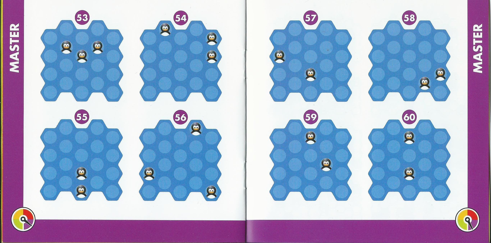

# penguins-game
Using python to solve this board game: http://www.smartgames.eu/en/smartgames/penguins-pool-party

We were given this game (thanks Yan!) and when I played or saw people playing I couldn't stop thinking, "How hard would be to solve it in Python?" or "How many possible ways are there to arrange the pieces?", and other questions.

The aim of this repository is to test different ways to solve the system.

Please buy the game if you like the idea.

See the booklet/ for the scans of the challenges.

# How to play
The aim of the game is to have some penguins on the board in pre-set positions (following one of the challenges in the booklet) and then put the ice around the penguins to fill the gaps.

See some examples here:

# Where to start
## From scratch
Read the game rules: buy the game or see scanned instructions (pay close attention to figure 3 with the shape of the blocks of ice for your own representation of the possible pieces):

(I would find it quite hard to generate the possible positions of the ice pieces without the physical game)

## Use src/utils/positions.py and src/utils/public_utils.py
The file positions.py has a list of positions for each piece (that we have named L, C, R and Z; names are based roughly on the shape of the pieces). This was generated by hand (thanks Jen!). I thought that given the shapes of the pieces, and the size and shape of the board, it would be faster to list them than generate them programatically.

Read the documentation in public.py and public_utils.py to understand how to use them.

## Check complete solutions
In the repository there are some complete implementations - check them and improve them, benchmark, play with them, etc.

The problem of the implemented solutions is that they work using "brute force". They are faster than a human but not smarter or as smart as a human. A possible implementation would be to mimic a human player: to not try stupid combinations. E.g. if a board has 4 penguins there aren't going to be any empty spaces: don't leave empty spaces. Or do not try invalid combinations as some solutions do (not cutting the search tree).

# Ideas
* Recognise the initial position of the penguins using an image recognition library (e.g. OpenCV Python). E.g. have a photo taken of the board and find the position of the penguins and then resolve this setup
* A player that plays more like a human player (instead of trying all the combinations)
* Find all the possible penguin-positions that can be a game (for one, two, three or four penguins)
* ...
